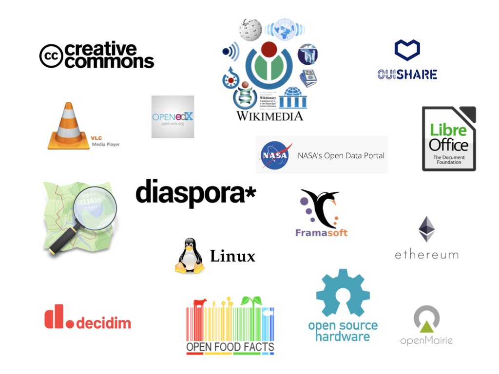

# Introduction to Digital Commons

<!-- Put the link to this slide here so people can follow -->
slides: https://hackmd.io/@raphodn/BkyI9MDXS

---

## What is a (digital) common ?

----

### A common is...

Always 3 things:
1) **People** that share the common (community / society)
2) A **resource** that is being produced (shared / consumed / maintained)
3) A **framework** to establish how the common is produced (governance)

Example: Nature (:droplet:, :dash:, :herb:), Infrastructure (city), Knowledge (:books:)

----

### Digital Commons



<!--
start: 0:03
end: 1:07
-->

----

### Digital Commons recap

- creation / distribution / governance / ownership of knowledge and technology
- for the public interest
- Efficient model of production (crowdsourcing) 
- Highly democratic

<!--
Public ? government, cities, academia
-->

----

### Examples !

<!--
creative commons CC
wikis, open-source software, GNU, Linux
Wikimedia, Wikipedia, ...
LibreOffice
govtech, civic tech, open data (NASA)
activism, social movements
cooperatives
academia
Ouishare
-->

---

## Examples deep-dive

----

### Knowledge

Wikipedia, Wikidata

Encyclopedia, Search engines, Metadata, NLP, Education, ...

----

### Cartography

OpenStreetMap

Maps.Me, Mapillary, Mapbox, OpenVegeMap, Pokémon GO, [Humanitarian OSM Team](https://www.hotosm.org/), ...

----

### Travel

[Wikivoyage](https://www.wikivoyage.org/)

----

### Food

OpenFoodFacts

Yuka, HalalOrNot, Nutri-score, ...

---

## Evolution of the commons

----

### Long ago :fire:

----

### A few centuries ago :european_castle:

----

### Today :rocket:

----

### Today

- liberalism: private slowly replaces public sector
- capitalism adoption of the commons: sharing economy (Airbnb, Uber), but without the governance

---

## Social / Political aspects

----

### Goals & issues

Commons vs Private
- Counterbalance the privatization of knowledge & resources
- Hard to fight big digital monopolies (more regulations needed)
- Not enough support from the public sector :money_with_wings:

Internally
- Lack of diversity (male dominated space, usually tech / educated profiles)
- Requires collaborative skills :open_hands:

----

### Future prospects

Closer ties with the public sector :school:
- Reduce dependency of public with private sector
- Develop local economy and communities, political/governance skills
- Co-creation of public policies (increase democracy participation)

Don't forget that technology is a tool and not a solution

----

### What about the private sector ?

Balancing 'for the customer' and 'for good'
- current framing: “customer is king” and the government (often an industry regulator) is what stands in the way of a corporation’s ability to serve her
- dedicate some time or the product/service for public interest
- find bigger problem to solve, rather than protect the business model that has delivered in the past
- innovation vs human progress

---

## Takeaway

If there is no commons, there is no market

Change of mindset: consume less, share more :smiley:

---

## Thank you :innocent:

---

## Additional links

Follow
- Mayo Fuster Morell: Spanish social researcher focused on the sharing economy and digital commons ([twitter](https://twitter.com/lilaroja))
- Matti Schneider ([twitter](https://twitter.com/matti_sg))

Read
- Creative Commons free book 'Made with Creative Commons' ([link](https://creativecommons.org/use-remix/made-with-cc/))
- Shareable.com '15 books to check out this summer' ([link](https://www.shareable.net/15-books-to-check-out-this-summer/))

---

## Sources

- Wikipedia: ['Commons'](https://en.wikipedia.org/wiki/Commons#Knowledge_commons) & ['Digital commons'](https://en.wikipedia.org/wiki/Digital_commons_(economics))
- Slideshare: ['Made With Creative Commons' by Paul Stacey](https://www.slideshare.net/Paul_Stacey/made-with-creative-commons)
- Medium: ['Unsquandering Of The Digital Commons'](https://medium.com/swlh/unsquandering-of-the-digital-commons-5b1c87385361), ['Dessine-moi un commun numérique'](https://medium.com/@matti_sg_fr/dessine-moi-un-commun-num%C3%A9rique-8d921451be31)

